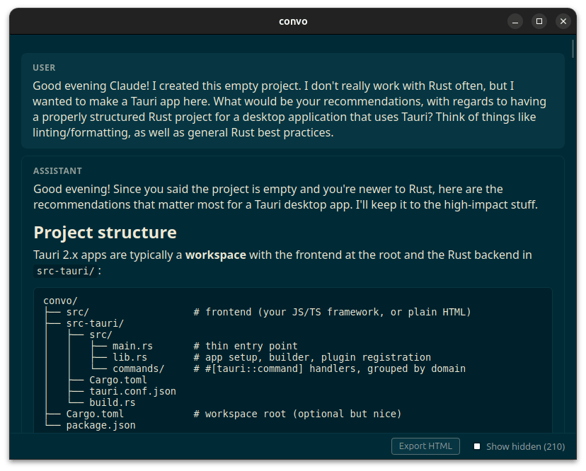

# Convo

A simple tool to view LLM conversations stored on your computer, so that they can be linked to from other places. Local only, your conversation files stay on your computer.



## Installation

`just install`

### Claude Code plugin installation

In the CLI version of Claude Code:

```
/plugin marketplace add jfim/convo-plugin
/plugin install convo@convo
```

After that, you can do things like ask Claude to add a link to the current conversation in your Obsidian vault, for example.

## URL support

Currently only supports `claude-code` URLs: `convo://claude-code/path/conversation_id`, eg `convo://claude-code/-home-jfim-projects-convo/d1449295-5c92-42db-a10f-571fd4ab36b1` will render the conversation in `~/.claude/projects/-home-jfim-projects-convo/d1449295-5c92-42db-a10f-571fd4ab36b1.jsonl`

## Linking from apps that block custom schemes (Obsidian, chat clients, ...)

Many apps refuse to make a `convo://` link clickable. The fix is a plain
`https://` link that 302-redirects into the scheme — the browser does the
handoff. A ready-to-host, hardened redirect (nginx and Caddy) lives in
[`deploy/redirect/`](deploy/redirect/); self-host it or point at an existing
instance. Set `CONVO_REDIRECT_HOST` and the `link` skill emits the clickable
`https://` form automatically.

Alternatively, if you trust random people on the internet, set
`CONVO_REDIRECT_HOST` to `convo.jean-francois.im`.

## License

Licensed under the [Apache License, Version 2.0](LICENSE).
